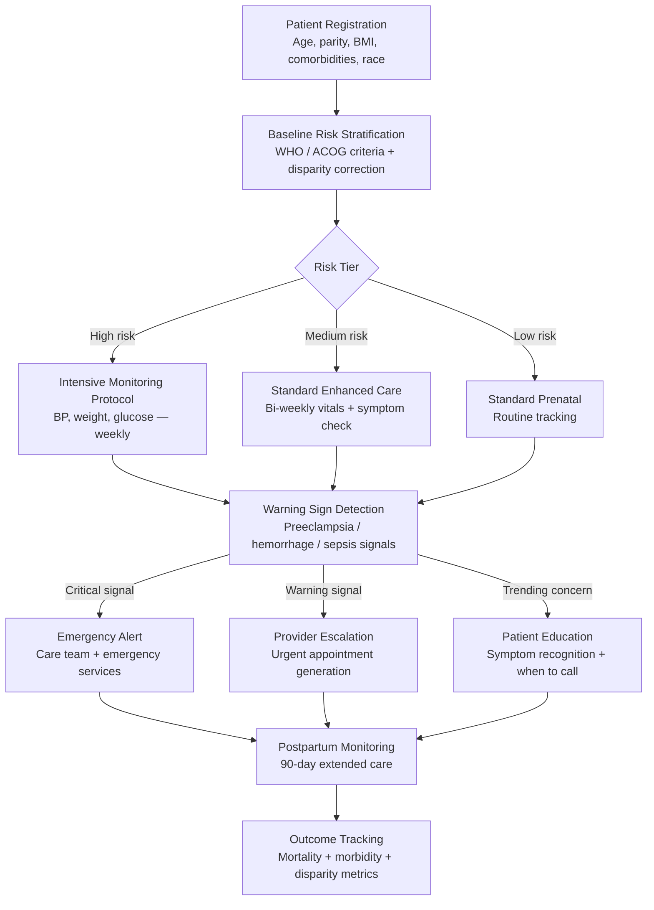

<p align="center">
  <h1 align="center">Foundation Safe Birth</h1>
  <h3 align="center"><em>Maternal mortality prevention. AI risk-scoring. Prenatal monitoring.<br>800 women die every day from causes we know how to prevent.</em></h3>
</p>

<p align="center">
  <a href="LICENSE"></a>
  
  
  
  
  <a href="https://mama.oliwoods.ai"></a>
  <a href="https://mama.oliwoods.ai/foundation"></a>
</p>

---

> **800 women die every day from complications of pregnancy and childbirth — 99% of them in low- and middle-income countries, from causes we know how to prevent.** In the United States specifically, the maternal mortality rate is 23.8 per 100,000 — three times higher than the UK, five times higher than Norway — and Black women die at 2.6x the rate of white women regardless of education or income. The leading causes are hemorrhage, hypertensive disorders, and sepsis: all detectable, all treatable with early intervention. **This library is the early intervention: AI risk-scoring that identifies high-risk pregnancies before complications develop, prenatal monitoring that works in low-bandwidth settings, and a racial disparity correction layer that actively counters the documented bias in existing clinical risk tools.** Because the data showing who is at risk is there — it just isn't being acted on.

---

## Why This Exists

- **Maternal mortality is rising in the U.S. — the only developed nation where it is.** The U.S. maternal mortality rate increased 40% between 2018 and 2021 (CDC). We are an outlier in the wrong direction.
- **86% of maternal deaths are preventable.** CDC Maternal Mortality Review Committees found 86% of U.S. maternal deaths were preventable with timely, appropriate care (CDC, 2022). This is not a mystery — it's a systems failure.
- **The racial disparity is not explained by clinical factors.** Black women with college degrees die at higher rates than white women without high school diplomas (Tucker et al., 2007). Systemic bias in care delivery and in existing risk tools must be explicitly corrected.
- **Low-resource settings need AI most.** Sub-Saharan Africa and South Asia account for 70% of global maternal deaths. These settings have the fewest obstetricians and the most need for AI-assisted risk stratification and community health worker support.

---

## How It Works



---

## Features & Modules

| Module | What It Does |
|--------|-------------|
| **risk-stratification** | Multi-factor maternal risk scoring using WHO, ACOG, and CMQCC frameworks. Incorporates age, parity, BMI, comorbidities, prior pregnancy history, and social determinants. Includes validated racial disparity correction |
| **preeclampsia-detection** | Evidence-based preeclampsia risk prediction using blood pressure trends, protein/creatinine ratios, and symptom constellation (headache, visual changes, RUQ pain). Aspirin prophylaxis triggering |
| **hemorrhage-risk** | Postpartum hemorrhage risk scoring using AWHONN tool. Identifies patients needing hemorrhage kits at delivery. Quantitative blood loss tracking |
| **sepsis-early-warning** | Modified obstetric early warning score (MOEWS). Flags sepsis trajectories: fever + tachycardia + hypotension patterns. Antibiotic protocol recommendations |
| **prenatal-monitoring** | Lightweight vitals tracking designed for low-bandwidth settings (SMS-based data entry option). Gestational weight gain curves, fundal height, fetal movement tracking |
| **disparity-correction** | Active bias correction layer for risk tools with documented racial disparities. Flags when a patient may be underscored due to tool limitations. Provides equity-adjusted risk estimates |
| **community-health-worker** | Simplified interface and decision support for CHWs in low-resource settings. Task lists, escalation protocols, and documentation designed for non-clinical staff |
| **postpartum-care** | Extended 90-day postpartum monitoring (vs. standard 6-week). Validated postpartum depression screening (Edinburgh Scale). Blood pressure monitoring for delayed preeclampsia |
| **emergency-protocols** | Obstetric emergency response checklists (hemorrhage, eclampsia, shoulder dystocia). Medication dosing calculators. Emergency contact routing |
| **outcome-tracker** | Longitudinal maternal outcome tracking. Generates disparity reports by race, geography, and insurance status. Supports quality improvement and grant reporting |

---

## How It Works — Technical

This is a **TypeScript algorithm library** designed for deployment in both high-resource and low-resource healthcare settings.

```typescript
import {
  stratifyMaternalRisk,        // Multi-factor risk scoring + disparity correction
  detectPreeclampsiaSignals,    // BP trend + symptom constellation
  scoreHemorrhageRisk,          // AWHONN quantitative risk tool
  calculateMOEWS,               // Modified obstetric early warning score
  screenPostpartumDepression,   // Edinburgh Postnatal Depression Scale
  generateEmergencyProtocol,    // Obstetric emergency checklists
  trackOutcomes,                // Longitudinal disparity reporting
} from "foundation-safe-birth";
```

**Low-resource design principles:**
- SMS data entry supported — no smartphone required for vital sign submission
- Offline-capable risk scoring — no internet needed for core algorithms
- CHW-optimized outputs — plain language, task-based, no clinical jargon
- Bandwidth-efficient sync — batched uploads when connectivity is available

---

## Research Backing

> CDC (2022). *Maternal Mortality Review Committees: A Report from 14 U.S. Maternal Mortality Review Committees, 2008–2017.* — 86% of reviewed maternal deaths were determined to be preventable. Top causes: hemorrhage (26%), cardiovascular conditions (14%), infection/sepsis (13%).

> Tucker, M. J., Berg, C. J., Callaghan, W. M., & Hsia, J. (2007). "The Black–White Disparity in Pregnancy-Related Mortality from 5 Conditions: Differences in Prevalence and Case-Fatality Rates." *American Journal of Public Health, 97*(2). — Black women die from preeclampsia, eclampsia, and embolism at 2-3x the rate of white women after controlling for socioeconomic factors, confirming systemic bias in care delivery.

> WHO (2023). *Trends in Maternal Mortality 2000–2020.* — Global maternal mortality has declined 34% since 2000 but remains at 800+ deaths/day. Sub-Saharan Africa accounts for 70% of global deaths. WHO 2030 target: <70 deaths per 100,000 live births globally.

> ACOG (2019). *Gestational Hypertension and Preeclampsia.* — Low-dose aspirin initiated before 16 weeks reduces preeclampsia risk by 24% in high-risk patients. This library encodes the triggering criteria.

> Creanga, A. A., Syverson, C., Seed, K., & Callaghan, W. M. (2017). "Pregnancy-Related Mortality in the United States, 2011–2013." *Obstetrics & Gynecology, 130*(2). — The definitive dataset showing U.S. maternal mortality trends and racial disparities that this library is designed to address.

---

## Quick Start

```bash
git clone https://github.com/OliWoods-Org/foundation-safe-birth.git
cd foundation-safe-birth
npm install
npm run build
npm test
```

## Tech Stack

- **Runtime:** Node.js + TypeScript
- **Validation:** Zod schemas
- **Database:** Supabase (PostgreSQL) with offline sync capability
- **AI:** Claude API for risk narrative generation and CHW decision support
- **Alerts:** Twilio (SMS — including low-bandwidth SMS vitals entry), push
- **Offline:** Service worker + local cache for core risk algorithms

---

## Related Projects

| Project | Description |
|---------|-------------|
| [mama-mental-health](https://github.com/OliWoods-Org/mama-mental-health) | Postpartum depression — Edinburgh screening feeds directly into mental health triage |
| [mama-elder-care](https://github.com/OliWoods-Org/mama-elder-care) | Shared HIPAA compliance architecture and benefits navigation |
| [mama-ai-clinic](https://github.com/OliWoods-Org/mama-ai-clinic) | Offline AI device for community health workers in low-resource settings |
| [foundation-rx-access](https://github.com/OliWoods-Org/foundation-rx-access) | Medication access for prenatal vitamins, aspirin prophylaxis, and postpartum care |

---

## Contributing

Maternal health is a global equity issue. We need expertise from everywhere:

- **Obstetricians and midwives** — Validate risk scoring models and emergency protocols
- **Community health workers** — Field testing of CHW interface in low-resource settings
- **Epidemiologists** — Racial disparity correction methodology review
- **Global health experts** — Adaptation for WHO South-East Asia and Africa region guidelines

See [CONTRIBUTING.md](CONTRIBUTING.md) for guidelines.

---

## License

AGPL-3.0. Free forever. An [OliWoods Foundation](https://github.com/OliWoods-Org) project.

> *"Every woman has the right to the highest attainable standard of health, which includes the right to dignified, respectful health care throughout pregnancy and childbirth."* — WHO

---

<p align="center">
  <strong>Built by the <a href="https://oliwoods.ai">OliWoods Foundation</a></strong><br>
  <em>Free forever. Open source. Because 86% preventable means 86% inexcusable.</em>
</p>
